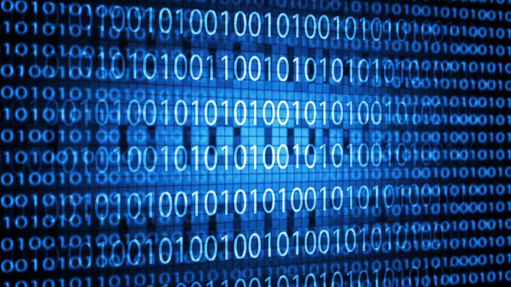
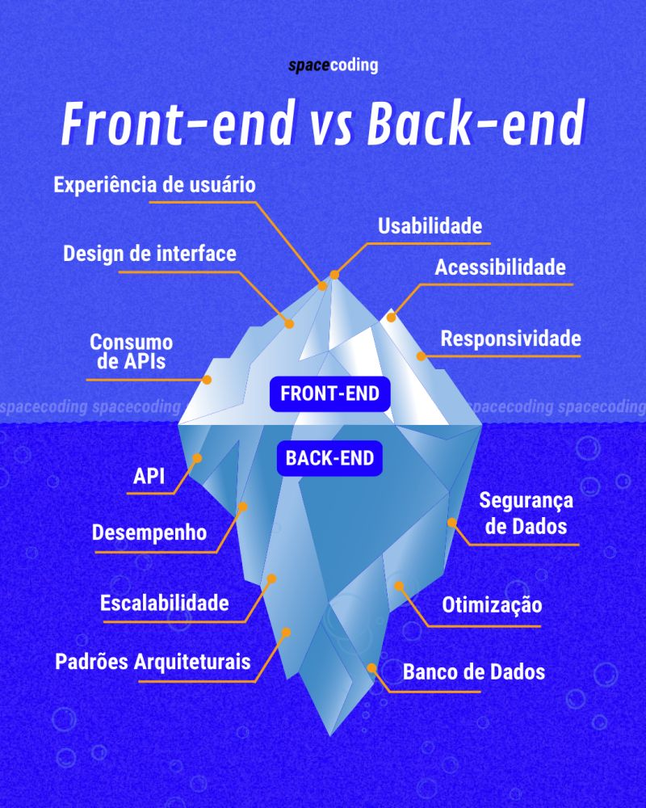
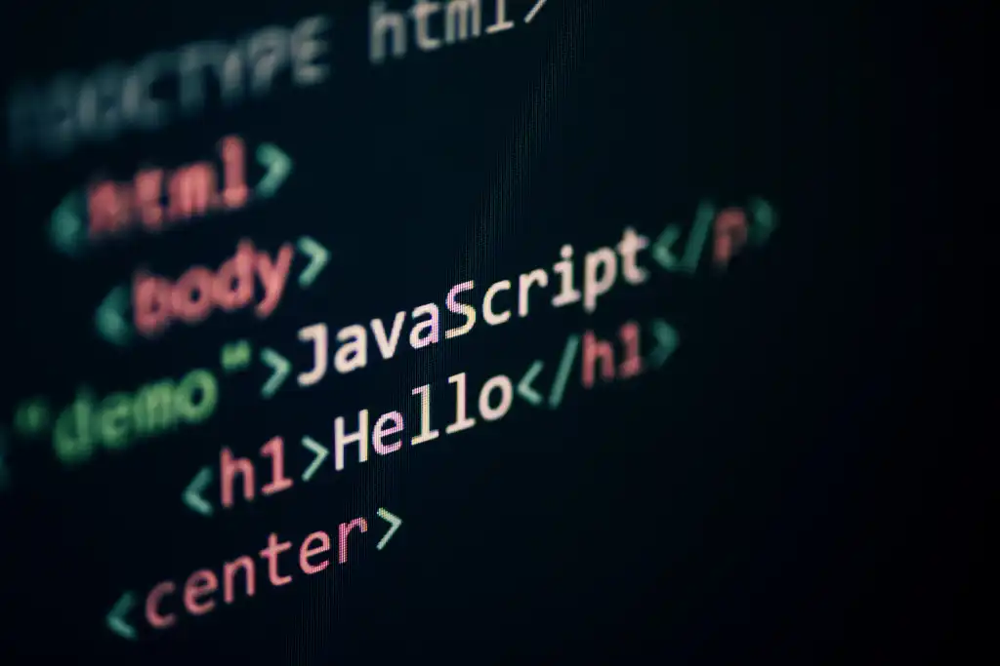
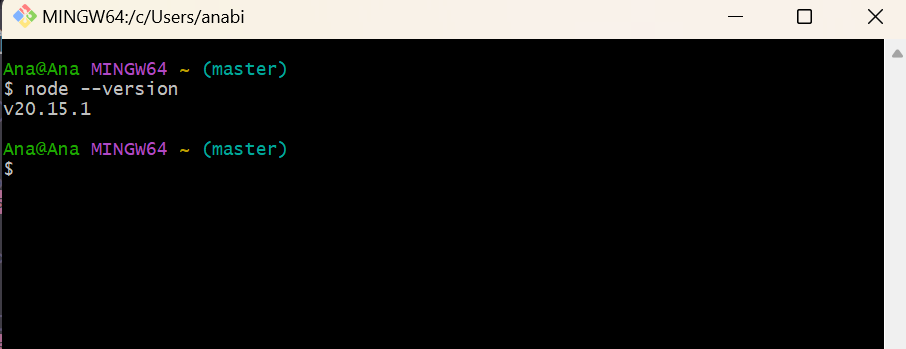

# Aula 1

## E por onde eu começo?
Eis a pergunta de milhões quando o assunto é tecnologia, afinal de contas existem de fato muitas informações por aí e é um tanto complexo filtrá-las no início da jornada de aprendizagem. No entanto, dentro do universo de desenvolvimento é muito importante ter conhecimento sobre <b>a base da programação</b>, isto é, <b>a lógica de programação</b>(certamente vocês ouvirão muito sobre essa "tal base" e aqui vamos dar uma introduzida no assunto).

> Dica de ouro: foquem em compreender os princípios básicos/o fundamento da coisa, pois é sobre isso que são construídos os sistemas. Os frameworks e bibliotecas podem até assumir nomes diferentes tanto no front-end quanto no back-end ao longo do tempo, mas no final das contas a lógica de programação é a mesma. Entao fiquem boas nisso. É o famoso básico bem feito.
  
### Funcionamento de um computador
  Assim como feijão com arroz, podemos definir a composição de um computador através da combinação de Hardware e Software.
  
  <p align="center">
      
  </p> 
 
  - <b>Hardware</b>: Toda a parte física dos componentes eletrônicos. No caso do computador: placa de rede, memória, processador, etc.
  
  - <b>Software</b>: Software é um conjunto de instruções escritas numa linguagem de programação, que por meio de um hardware consegue ser executado por um aparelho eletrônico. 


### Lógica e Programação 
  
  - <b>Lógica:</b> Pode-se definir como o estudo dos princípios do raciocínio válido. O principal item que estudamos em lógica são os princípios que governam a validade dos argumentos. Assim, `uma proposição não pode ser verdadeira e falsa ao mesmo tempo`, ou seja, `uma alternativa só pode ser verdadeira ou falsa`.
    
  - <b>Programação:</b> A programação é um processo criativo realizado por pessoas programadoras(ou desenvolvedoras) para instruir um computador sobre como realizar uma tarefa. As instruções descritas através de linguagens de programação e são conhecidas como códigos. As linguagens de programação são responsáveis por transcrever para o computador as instruções desejadas.
    - A linguagem que o computador usa para entender as instruções de programação é chamada de linguagem de máquina. Essa linguagem consiste em sequências de números binários (0s e 1s), que representam instruções que o processador pode executar diretamente.
  
    <p align="center">
        
    </p> 

### Como a programação tem nos ajudado?

`A programação está em todos os lugares!`

Esses processos que são desenvolvidos e executados em um computador servem para construir sites, aplicativos, desenvolver eletrônicos e até mesmo para criar inteligência artificial e robôs. Quando dizemos que a programação está em tudo, podemos pensar em citar mais algumas opções como: serviço de transporte, bancos e serviços financeiros, saúde, casa inteligente! Em que outras situações do dia a dia vocês conseguem enxergar programação?
  
  
### Algoritmos  
<p align="center">
  <a href="http://www.youtube.com/watch?feature=player_embedded&v=pdhqwbUWf4U&t=1s&ab_channel=OBaricentrodaMente
  " target="_blank">
    
  </a>
</p>

<details>
  <summary>O que são algoritmos?</summary>

  O <b>Algoritmo</b> é uma sequência de instruções lógicas e finitas que são seguidas, passo a passo, com o propósito de atingir um objetivo previamente definido. Quando criamos um algoritmo computacional podemos determinar ações, atribuir condições, manipular e processar dados, visando alcançar o objetivo final.

  <p align="center">
    
  </p>
  
</details>

<details>
  <summary>Fazendo um bolo</summary>
   <p align="center">
    
  </p>
 
</details>

<details>
  <summary>Verificação de um número</summary>
  <p align="center">
    
  </p>
</details>

<details>
  <summary>Verificação da lâmpada</summary>
  
  <p align="center">
    
  </p>
  <p>
    A simbologia é o conjunto de formas geométricas e símbolos usados para representar diferentes etapas de um processo ou algoritmo. Cada forma tem um significado específico, como indicar ações, decisões, início ou fim, tornando mais fácil visualizar e compreender a lógica de um sistema ou programa. Ela ajuda a padronizar e comunicar ideias de forma clara
  </p>
  <p>
    Retângulo - representa uma ação ou processo a ser executado 
  </p>
  <p>
    Losango - representa uma decisão ou condição 
  </p>
  <p>
    Oval: representa o início ou fim do fluxo.
  </p>
</details>

<details>
  <summary>Soma de dois números</summary>
  
  <p align="center">
    
  </p>

</details>

<details>
  <summary>Agora é sua vez</summary>
  
 ` Crie um algoritmo escrito em português para descrever a sua sequência de passos para decidir um almoço. ` 
 
</details>


### Lógica de Programação 
`
 💫 É agora que as coisas começam a ficar um pouco mais divertidas, então sejam muito bem vindas! 
`

Lógica executada até atingir um objetivo ou encontrar uma solução de um problema. São os pequenos passos que devemos seguir até encontrarmos uma solução para o programa que queremos construir ou para solucionar um problema encontrado no código (processo chamado depuração).

Olhando mais de perto para o desenvolvimento de aplicações, vemos uma subdivisão entre <b>back-end</b> e <b>front-end</b>.

<p align="center">
  
</p>

<p align="center">
  
</p>

<p align="center"> 
    
</p>
  
  - <b>Cliente:</b> é o dispositivo ou programa que faz uma solicitação de serviço. Função: Pede dados ou ações ao servidor.

  - <b>Servidor:</b> é o dispositivo ou programa que processa e responde às solicitações do cliente. Função: Fornecer serviços, dados ou recursos.

  
### Linguagens de programação
  
  Como dito anteriormente, os computadores processam e interpretam informações por meio de bits binários representados por 1s (uns) e 0s (zeros). Agora, imagine se tudo que realizamos em um computador precisasse ser escrito apenas utilizando essa linguagem binária. É exatamente por isso que as linguagens de programação existem. Elas servem como uma ponte que conecta as pessoas desenvolvedoras (também conhecidas como programadoras) às máquinas. O papel das linguagens de programação é receber as instruções fornecidas no código, compreender a tarefa desejada e traduzi-las para uma forma que o computador consiga interpretar e executar.

  Chamamos de código a forma que instruímos com sequências lógicas as tarefas que o computador precisa executar em uma determinada linguagem de programação. 

 ` Durante esse curso, nós utilizaremos a linguagem JavaScript ` 

<p align="center"> 
    
</p>


## Preparando o ambiente de desenvolvimento
Em seguida, iremos configurar nosso ambiente de desenvolvimento para que durante as próximas aulas tenhamos apenas que nos preocupar com aprender lógica de programação e fazer nosso código funcionar! Para isso, seguiremos alguns passos.

1. Baixe o [Node](https://nodejs.org/en/) e instale no seu computador
  <p align="center">
    
  </p>

> Baixe a versão mais atual do NodeJS
  
  Normalmente vamos nos deparar com dois tipos de downloads. O primeiro é o __LTS__, que é uma sigla para __Long Term Support__, isso quer dizer que é uma versão segura, estável e confiável para uso. O segundo é a __Current__, que é a versão atual em que a equipe está trabalhando e abrange as mais recentes atualizações da ferramenta, todavia, não há garantia de estabilidade.

> Instalem o LTS 
  
2. Neste estágio, vamos conferir se deu tudo certo o processo de instalação. Abra o terminal do seu computador (o git bash já instalado nos módulos anteriores) e digite o seguinte comando: `node --version`, você deve receber uma resposta com o numero da versão que você instalou como mostrado no print abaixo. Se você receber um erro como `command not found` isso significa dizer que deu algo errado na sua instalação.

  <p align="center">
    
  </p>

3. Caso todas as etapas já tenham sido instaladas no módulo anterior desconsiderem os passos acima.

4. Seguindo a tradição, precisamos começar com o `Olá Mundo/Hello World` para que não sejamos amaldiçoados pela deusa da programação. 
    - Abra o Visual Studio Code
    - Crie um arquivo `primeiro-programa.js`
    - Escreva o código abaixo e em seguida salve seu arquivo 
      ```javascript
        console.log('Olá mundo');
      ```

5. Agora, vamos chamar o Node para rodar nosso código.
    - Abra o terminal do VSCode
    - Digite o seguinte comando: `node primeiro-programa.js`
    - Se der tudo certo, você vai ver no terminal a mensagem que você inseriu dentro do console.log 🎉
    
6. Agora a coisa vai melhorar mais ainda. O VSCode possui vários plugins/extensoes muito bacanas e vamos fazer uso de um deles. O `Code Runner`. Vá em extensões, pesquise por `Code Runner` e instale. 

  <p align="center">
    
  </p>

7. Dias de Glória! Agora, sempre que quisermos rodar nosso programa, basta clicar no icone de ▶️ no canto superior direito do seu VSCode.

---

`Aconteceu qualquer problema?`
Use o [Replit](https://replit.com/~) até conseguir resolver, dessa forma você não fica de fora das atividades!

---
