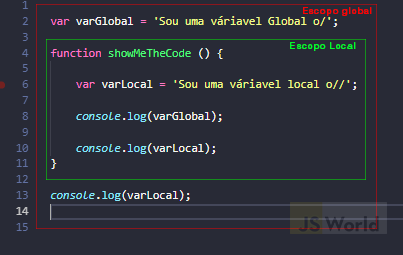

# Aula 02

## Introdução a JavaScript
Hoje vamos colocar a mão massa conhecendo a sintaxe básica da linguagem JavaScript. Lets que lets? 

### JavaScript
JavaScript é uma linguagem de programação criada originalmente para tornar os websites mais interativos. Graças a ela, foi possível desenvolver aplicações web modernas, onde o usuário pode interagir diretamente com a página sem precisar recarregá-la a cada ação. Além disso, o JavaScript também é amplamente utilizado em sites tradicionais para implementar funcionalidades interativas de maneira inteligente.

Inicialmente, JavaScript foi projetado para atender demandas do front-end. Com o avanço da tecnologia e o aumento das exigências, surgiu a necessidade de usar a mesma linguagem tanto no lado do cliente quanto no servidor, otimizando processos e serviços. Nesse contexto, o NodeJS foi desenvolvido como uma solução eficiente para programação back-end, funcionando como um ambiente que utiliza JavaScript fora do navegador.

O NodeJS, conforme definido oficialmente, é um runtime, ou seja, um ambiente de execução composto por códigos, APIs (interfaces que facilitam a obtenção e manipulação de dados) e bibliotecas que possibilitam rodar programas JavaScript fora do navegador web. Ele funciona como um interpretador, permitindo que o JavaScript seja usado no servidor, diretamente pelo terminal. Essa flexibilidade foi o que inspirou o engenheiro de software Ryan Dahl a criar o NodeJS, um programa que você instala no computador para usar JavaScript de maneira menos limitada, expandindo seu uso para o back-end.

<p align="center">
  
</p> 

> Java e JavaScript não são a mesma coisa.

<p align="center">
  
</p> 


### Tipos de dados primitivos
São os tipos básicos e imutáveis de dados no JavaScript:

- `Number` representa um conjunto de dados numéricos positivos ou negativos, inteiros, reais ou decimais, também inclui valores especiais como NaN(Not-a-Number);

- `String` é a sequência de caracteres, sejam eles textuais, numericos, simbolos e afins, delimitada por aspas simples (''), aspas duplas("") ou crases(``);

- `Boolean` representa um dado lógico com apenas duas possibilidades: ser verdadeiro ou falso (true or false);

- `Null` representa uma variável vazia ou nula que não armazena nada - é um valor intencionalmente vazio;

- `Undefined` um valor atribuído automaticamente a uma variável que foi declarada, mas não inicializada - é algo que nao foi definido;

- `Symbol` introduzido no ES6, representa valores únicos e imutáveis;

- `BigInt` introduzido no ES11, permite representar números inteiros maiores que o limite do tipo Number.


### Tipos de dados não primitivos
São estruturas mais complexas que podem conter coleções de valores:

- `Object` representa uma coleção de pares chave-valor;
    const pessoa = {
      nome: 'Ana',
      idade: 23
    };

- `Array` representa uma lista ordenada de valores;
    const numeros = [1, 2, 3, 4];

- `Function` representa uma função reutilizável;
    function soma(a, b) {
      return a + b;
    }

> Dica importante: para verificar o tipo de um dado, use o operador typeof
> console.log(typeof 23); // number  <br>
> console.log(typeof 'ana'); // string  <br>
> console.log(typeof true); // booleano  <br>

## Variáveis e Constantes

As variáveis tem o poder de armazenar informações inseridas em nossos códigos. A forma que escolhemos determinará se será uma variável de escopo local ou escopo global. 

  - <b>Escopo global</b> quer dizer que uma vez declarada, essa variável estará “viva” ”durante toda a aplicação e poderá ser acessada em toda a aplicação.

  - <b>Escopo local</b>, o escopo das variáveis locais é vinculado ao bloco onde elas são declaradas. Sendo assim, elas “morrem” ao final da instrução em que estão sendo executadas.

  <p align="center">
    
  </p> 

### Declarando variáveis e constantes

- `var` declara uma variável, opcionalmente, inicializando-a com um valor. [USO NÃO RECOMENDADO]

- `let` declara uma variável local de escopo do bloco, opcionalmente, inicializando-a com um valor.

- `const` declara uma constante de escopo de bloco, apenas de leitura.

### Padrões de nomeclatura 
`Iremos utilizar o camelCaseNoCurso`

<p align="center">
  
</p> 
   

#### Bora praticar 
  Abra o VSCode

  <details>
    <summary>Prática 1: crie 4 constantes e mostre no console os seus respectivos valores</summary>

```javascript
const fruta1 = "mexerica";
const fruta2 = "uva";
const fruta3 = "laranja";
const fruta4 = "jaca" 

console.log(fruta1)
console.log(fruta2)
console.log(fruta3)
console.log(fruta4)

```
  </details>
    
    
  <details>
    <summary>Pratica 2: Declare e insira os valores nas seguintes variáveis ou constantes: nome do país, pontos turísticos da sua cidade, capital do país, quantidade de estados, o país é da América Latina?
    </summary>

```javascript
const nomePais = "Brasil";
let pontosTuristicos = "MASP, museu do ipiranga, pinacoteca";
const capitalPais= "Brasilia";
const quantidadeEstados = 26;
const eDaAmericaLatina= true;
```

  </details>

### Concatenação
  <b>Tradicional: </b> Através do + conseguimos unir textos com variaveis.
  
  <b>Template string: </b> Através do da crase envolvendo toda a frase, adicionando as variaveis dentro do `${}` conseguimos unir textos e variáveis.

```javascript
const nomePais = "Brasil";
const capitalPais= "Brasilia";
const quantidadeEstados = 26;

// Tradicional
console.log("Meu nome é Ana e moro no " + nomePais + " que tem " + capitalPais + " como capital. Aqui sou muito feliz pois tenho "+ quantidadeEstados + " estados para desbravar!");

// Template string
console.log(`Meu nome é Ana e moro no ${nomePais} que tem ${capitalPais} como capital. Aqui sou muito feliz pois tenho ${quantidadeEstados} estados para desbravar!`);
```

#### Bora praticar 
Abra o VSCode
  
  <details>
    <summary>Pratica 3: Crie as seguintes constantes e em seguida use a criatividade para concatená-las formando uma frase: primeiro nome; último nome; ano de nascimento; cor preferida; hobby; um sentimento.
    </summary>
   </details>
   
### Manipulação de strings

Existem algumas formas de manipular string: 
- `length` checa o tamanho da string;
- `toUpperCase` converte todos os caracteres de uma string para maiúsculas;
- `toLowerCase` converte todos os caracteres de uma string para minúsculas;
- `trim` remove espaços em branco no início e no fim da string;
- `split` separa uma string definindo um limitador;
- `replace` substitui trechos da string;
- `slice` retorna só um trecho da string;
- `includes` verifica se um valor está presente na string, retornando true ou false;
- `startsWith` verifica se a string começa com um valor específico;
- mais: https://developer.mozilla.org/en-US/docs/Web/JavaScript/Reference/Global_Objects/String 


## Operadores aritméticos e lógicos

```javascript
const soma = 10 + 2;
const subtracao = 10 - 2;
const multiplicacao = 10 * 2;
const divisao = 10 / 2;
```

Além dos mais comuns citados acima existe também o módulo da divisão que consiste no resto da divisão de dois números.

```javascript
const moduloDaDivisao = 10 % 10;
```

### Operadores de comparação e lógico

```javascript
// Comparação
const estritamenteIgual = 10 === 10;
const estritamenteDiferente = 10 !== 10;
const maiorQue = 10 > 10;
const maiorOuIgualQue = 10 >= 2;
const menorQue = 2 < 10;
const menorOuIgualQue = 10 <= 10;

// Lógicos
const and_e = estritamenteIgual && maiorQue;
const or_ou = maiorQue || estritamenteDiferente;
const not_nao = !estritamenteDiferente;
```

#### Bora praticar 
Abra o VSCode

<details>
  <summary>Pratica 4: crie 2 constantes: numero1 e numero2, cada uma contendo um valor numérico. Em seguida, crie mais 5 constantes: soma, subtração, multiplicação, divisão e modulo, que contenha as reespectivas operações usando as constantes numero1 e numero2</summary>

```javascript
const soma = numero1+numero2;
const subtracao = numero1-numero2;
const multiplicacao= numero1*numero2;
const divisao= numero1/numero2;
const modulo= numero1%numero2;
```
</details>
    
  
### 💡 Dicas
Durante o processo de aprendizagem inserir comentários ao longo do código para descrevê-lo pode ser útil para relembrar.
 ```javascript
 // comentário de uma linha

/* isto é um comentário longo
   de múltiplas linhas.
*/

```
---
